# 📄 Almacenamiento de PDFs en Vercel Serverless

## 🎯 Resumen Ejecutivo

Los informes PDF de evaluación de ciberseguridad se almacenan en **Base64 dentro de la base de datos PostgreSQL**, específicamente en el campo `pdfData` de la tabla `files`. 

**Razón:** Vercel serverless tiene filesystem de **solo lectura**, por lo que no se pueden guardar archivos en disco.

---

## 📊 Arquitectura de Almacenamiento

### 1️⃣ Generación del PDF (En Memoria):

```javascript
// backend/services/pdfReportService.js
// El PDF se genera usando jsPDF y se mantiene en memoria
const pdfBuffer = Buffer.from(doc.output('arraybuffer'));
```

### 2️⃣ Conversión a Base64:

```javascript
// backend/controllers/pdfController.js
const base64Data = pdfBuffer.toString('base64');
```

### 3️⃣ Almacenamiento en Base de Datos:

```javascript
// backend/controllers/fileController.js
await prisma.file.update({
  where: { id: fileRecord.id },
  data: {
    pdfData: base64Data,           // PDF en Base64
    reportPath: 'base64://filename' // Indica almacenamiento en DB
  }
});
```

---

## 🗄️ Esquema de Base de Datos

### Tabla `files` (Supabase PostgreSQL):

```sql
CREATE TABLE files (
  id VARCHAR(255) PRIMARY KEY,
  filename VARCHAR(255) NOT NULL,
  filepath VARCHAR(500),
  fileSize BIGINT,
  mimeType VARCHAR(100),
  status VARCHAR(50) DEFAULT 'PENDING',
  result TEXT,                     -- Resultado JSON de evaluación
  reportPath VARCHAR(500),         -- Ruta virtual: "base64://filename"
  pdfData TEXT,                    -- 🔥 PDF almacenado en Base64
  userId VARCHAR(255),
  createdAt TIMESTAMP DEFAULT NOW(),
  updatedAt TIMESTAMP DEFAULT NOW(),
  FOREIGN KEY (userId) REFERENCES users(id)
);
```

**Campo `pdfData`:**
- Tipo: `TEXT` (puede almacenar strings muy largos)
- Contenido: PDF codificado en Base64
- Tamaño promedio: 200KB - 2MB (según complejidad del informe)

---

## 📥 Descarga de PDFs

### Endpoint: `GET /api/files/:id/report/download`

```javascript
// backend/controllers/fileController.js
const downloadReport = async (req, res) => {
  const file = await prisma.file.findUnique({ where: { id } });
  
  if (file.pdfData) {
    // 🔥 Recuperar PDF desde Base64 en DB
    const pdfBuffer = Buffer.from(file.pdfData, 'base64');
    
    res.setHeader('Content-Type', 'application/pdf');
    res.setHeader('Content-Disposition', `attachment; filename="${filename}"`);
    res.send(pdfBuffer);
  }
};
```

---

## ✅ Ventajas de este Enfoque

| Ventaja | Descripción |
|---------|-------------|
| ✅ **Compatible con Vercel** | No requiere filesystem escribible |
| ✅ **Sin configuración adicional** | No necesita S3, Cloudinary, etc. |
| ✅ **Backup automático** | Los PDFs se respaldan con la DB |
| ✅ **Transaccional** | PDF y metadatos en una sola transacción |
| ✅ **Sin costos extras** | No hay servicios de storage adicionales |

---

## ⚠️ Consideraciones

### Tamaño de Almacenamiento:

- **PDF típico**: 500KB - 1.5MB
- **Base64 overhead**: +33% (1MB PDF = 1.33MB Base64)
- **Supabase free tier**: 500MB (suficiente para ~300-400 PDFs)

### Performance:

- **Generación**: 2-3 segundos (incluye llamadas a ChatGPT)
- **Descarga**: ~100ms para recuperar de DB y enviar
- **Base de datos**: No hay impacto significativo en queries normales

---

## 🔄 Flujo Completo de Procesamiento

```mermaid
graph LR
    A[Usuario sube CSV] --> B[Procesar evaluación]
    B --> C[Generar PDF en memoria]
    C --> D[Convertir a Base64]
    D --> E[Guardar en campo pdfData]
    E --> F[Usuario descarga PDF]
    F --> G[Recuperar Base64 de DB]
    G --> H[Convertir a Buffer]
    H --> I[Enviar como application/pdf]
```



---

## 📌 Ubicación de los Archivos de Código

### Generación:
- **Service**: `backend/services/pdfReportService.js` (línea ~121)
- **Controller**: `backend/controllers/pdfController.js` (línea ~40-60)

### Almacenamiento:
- **Schema**: `backend/prisma/schema.prisma` (campo `pdfData`)
- **Controller**: `backend/controllers/fileController.js` (línea ~95-105)

### Descarga:
- **Route**: `backend/routes/fileRoutes.js` (línea ~45)
- **Controller**: `backend/controllers/fileController.js` (línea ~500-550)

---

## 🧪 Verificar Almacenamiento

### En Supabase Dashboard:

1. Ve a: https://supabase.com/dashboard/project/scswxvfghgschhlumvmu
2. Ve a **Table Editor** → Tabla `files`
3. Busca un registro con `status = 'COMPLETED'`
4. El campo `pdfData` debe tener un largo string Base64 (empieza con `JVBERi0x...`)
5. El campo `reportPath` debe ser: `base64://filename.pdf`

### Usando SQL:

```sql
-- Ver PDFs almacenados (sin mostrar el Base64 completo)
SELECT 
  id,
  filename,
  status,
  reportPath,
  LENGTH(pdfData) as pdf_size_bytes,
  LENGTH(pdfData) / 1024 as pdf_size_kb,
  createdAt
FROM files
WHERE pdfData IS NOT NULL
ORDER BY createdAt DESC;
```

---

## 🚀 Alternativas Futuras (Opcional)

Si en el futuro el volumen de PDFs crece mucho, podrías considerar:

### 1️⃣ Almacenamiento en S3:
```javascript
const AWS = require('aws-sdk');
const s3 = new AWS.S3();

await s3.putObject({
  Bucket: 'ciberseguridad-pdfs',
  Key: `reports/${fileId}.pdf`,
  Body: pdfBuffer
}).promise();
```

### 2️⃣ Supabase Storage:
```javascript
const { data, error } = await supabase.storage
  .from('reports')
  .upload(`${fileId}.pdf`, pdfBuffer, {
    contentType: 'application/pdf'
  });
```

### 3️⃣ Cloudinary:
```javascript
const cloudinary = require('cloudinary').v2;

const result = await cloudinary.uploader.upload_stream({
  resource_type: 'raw',
  public_id: `reports/${fileId}`
}, pdfBuffer);
```

---

## ✅ Conclusión

El sistema actual de almacenamiento en Base64 dentro de PostgreSQL es:
- ✅ **Funcional** para Vercel serverless
- ✅ **Eficiente** para el volumen esperado
- ✅ **Simple** de mantener y debuggear
- ✅ **Sin costos adicionales**

**No se requieren cambios** a menos que el volumen de PDFs supere los 1000+ archivos.
